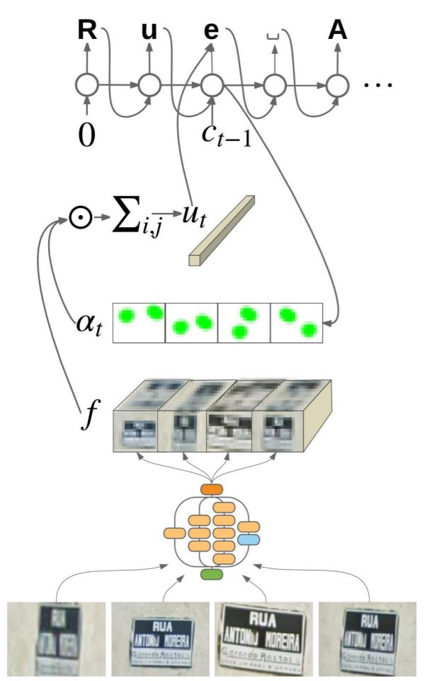

# [Attention-based Extraction of Structured Information from Street View Imagery](https://arxiv.org/abs/1704.03549)

## Abstract

* Paper presents a model based on ConvNets, RNN's and a novel attention mechanism. Achieves **84.2%** on FSNS beating the previous benchmark (**72.46%**).

* Paper studies the speed/accuracy tradeoff that results from using CNN feature extractors of different depths.

## Introduction

* Traditional Optical Character Recognition (OCR) systems mainly focus on extracting text from scanned documents. Text acquired from natural scenes is more challenging due to visual artifacts, such as *distortion, occlusions, directional
blur, cluttered background or different viewpoints*.

* Thus, this paper mostly focuses on how to ignore all the other stuff.

* Accuracy and speed studied with `inception-v2`, `inception-v3`, and `inception-resnet-v2` as input to the attention model.
  * `Inception-v3` and `inceptionresnet-v2` perform comparably, and *both significantly outperform* `inception-v2`.

  * For all three networks, the accuracy initially increases with depth, but then starts to decrease. This is in contrast to vanilla image classification where accuracy monotonically increases with depth. **"We believe the difference is that image classification needs very complicated features, which are spatially invariant, whereas, for text extraction, it hurts to use to use such features."**

## Methods

### A. CNN-based feature classification

* Pretty straightforward, we use one of the above CNN's to extract features.

* We'll use f = {f1, j, c} to denote the feature map derived by passing the image x through a CNN (here i, j index locations in the feature map, and c indexes channels).

### B. RNN

* The main challenge is how to convert the feature maps into a single text string.

* The input to the RNN is determined by a spatially weighted combination of image features. A technique called greedy encoding is applied to compute the most likely letter (Read paper for the math, it is explained quite well).

### C. Spatial attention

* All previous attention mechanisms are permutation invariant. This means that we could shuffle the order of the pixels and the mapping would remain the same. To make the model “location aware”, we use a one-hot encoding of the spatial coordinates.

* This is equivalent to adding a spatially varying matrix of bias terms.

* This also serves to account for the big jump to the left side of the line below in multi-line recognition problems.

### D. Handling multiple views

* In the FSNS dataset, we have four views for each input sign, each of size 150x150. (Check the data [here](https://github.com/tensorflow/models/tree/master/research/attention_ocr)).

* We use the CNN to compute four feature maps and concatenate them horizontally to create one single input feature map.

### E. Training

* We train the model using (penalized) maximum likelihood estimation.

* "Since the model is autoregressive, we pass in the ground truth labels as history during training, as is standard. Note that we do not need ground truth bounding boxes around any of the text, which makes collecting training data
much easier." (**Absolutely didn't get this**)

* We use stochastic gradient descent optimization with initial learning rate **0.002**, decay factor **0.1** after **1,200,000**  steps and momentum **0.75**. We finish training after **2,000,000** steps.

* We randomly crop with the requirement to cover at least **0.8** area of the original input image and new aspect ratio to be between **0.8** and **1.2**. After cropping we resize it to the initial size with one randomly chosen interpolation procedure: *bilinear, bicubic, area, or nearest-neighbor*. Then we apply random image distortions: *change of contrast, hue, brightness, and saturation*.

* To regularize the model, we use weight decay **0.00004**, label smoothing **0.9** and LSTM values clipping to **10**. LSTM unit size is **256**.

## Datasets

* I'm only going to note down facets about the dataset that are important to the model.

### A. FSNS Dataset

* All the transcriptions of the street name are up to 37 characters long. (Our model takes advantage of this fact and
always runs 37 steps, with an optional out-of-alphabet padded symbol.) There are 134 possible characters to choose from at each location, but most of the street names consist only of Latin letters.

### B. Street View Business Names Dataset

* This dataset is significantly more challenging than FSNS, as storefronts have a lot more variation, and richer contextual information, compared to the street name signs. Moreover, the business name can be a small fraction of the entire image.

## Experimental Results

### A. Accuracy on FSNS

* We use the full sequence accuracy metric to benchmark our model. It is a challenging metric, as it requires every
character to agree with the ground truth.

* Check the paper for some tables with interesting results.

### B. The effect of depth on FSNS

* **The main computational bottleneck in our model is the CNN-based feature extractor.**

* For all three models listed above, the accuracy improves for a while, and then starts to drop as the depth increases.

* The reason for this is that character recognition does not benefit from the high-level features that are needed for image classification.

* Also, the spatial resolution of the image features used as input for attention decreases after every max pooling operation, which limits the precision of the attention mask on a particular character.

* We don’t see any dependency between accuracy and the theoretical receptive field of the neurons in the last convolutional layer, but the effective field of view can be much smaller.

### C. Visualization of attention on FNS

* See the technique to generate the saliency map from the paper.

* **I'd say that this is the most important section in the entire paper**.

### D. Error Analysis on FSNS

* 48% of the “errors” is due to the incorrect ground truth.

* The most common error is due to the wrong accent over the letter e. This is also the most common mistake in the ground truth transcription.
